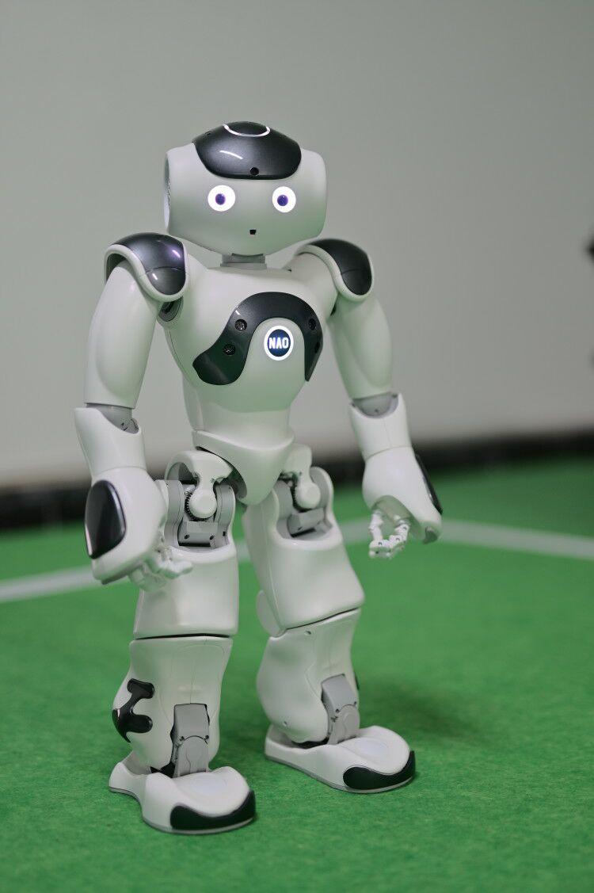
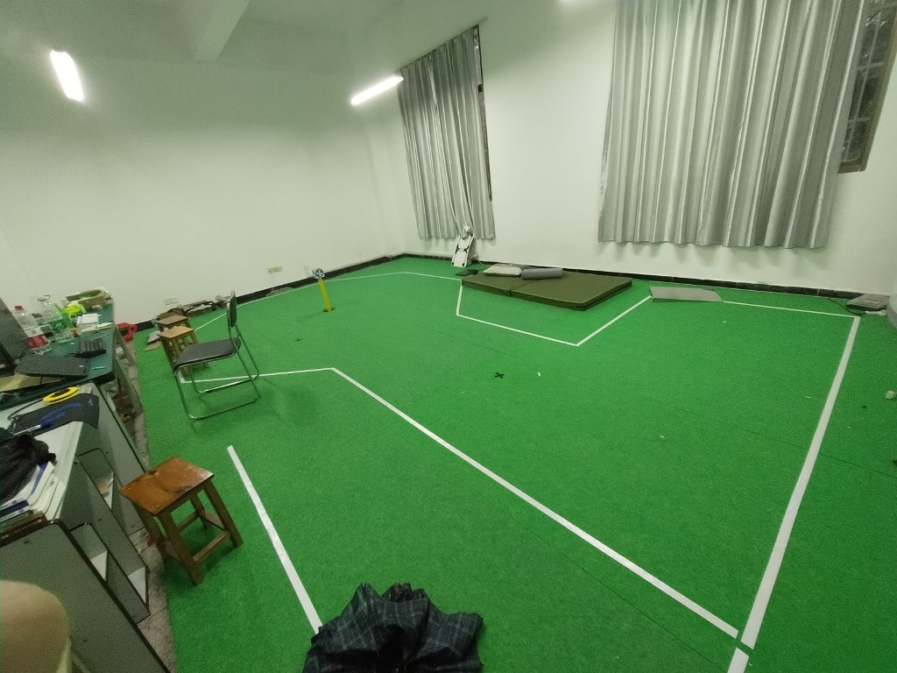
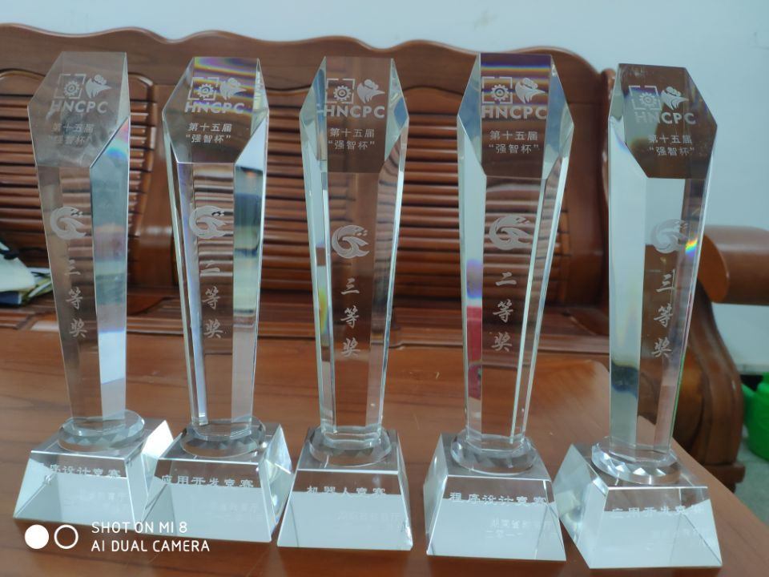

# HNIT-JXROBOT-RUN

湖南工学院ACM机器人组NAO机器人接力赛项目。  
环境 Python2.7 32位  
SDK Python 2.7 SDK Binaries  
环境搭建教程: [NAO 机器人环境搭建](./tutorial.md)  
比赛规则: [机器人接力赛比赛规则](./rule.md)

使用OpenCV做图像识别，判断机器人方向，并实时调整。
使其在白线内走路（跑步）

我们的机器人

我们的实验室

奖杯

