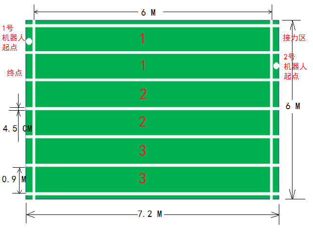

# 机器人接力赛比赛规则

## 竞赛介绍

在人类社会和自然界中，存在人类无法到达的地方和可能危及人类生命的特殊场合，
在人类社会和自然界中，存在人类无法到达的地方和可能危及人类生命的特殊场合，
比如行星表面、工地、矿井、救援反恐等等，所以仿人机器人就蓬勃发展起来。
腿式行走机器人基于仿生学原理，该机构几乎可以适应任何路面的行走，且具有良好的机动性，
其运动系统具有良好的主动隔振功能，可以比较轻松地通过松软路面和大跨度障碍。
缺点是行进速度低缓、效率较低，而且由于腿部与地面接触面积相对较小，遇到非刚性地面状况时会出现下陷的情况。
而且其对腿部关节部位的制造要求较高，机构形式在各种移动机构中最复杂，控制也十分困难，
目前尚处于研究和实验阶段，有各种各样的技术难题急需克服。

人类的大部分行为能力是需要借助于逻辑分析，例如思考问题需要非常明确的逻辑推理分析能力，
而相对平常化的走路，说话之类看似不需要多想的事，其实也是种简单逻辑，因为走路需要的是平衡性，
大脑在根据路状不断地分析判断该怎么走才不至于摔倒，而机器人走路则是要通过复杂的计算来进行。
“教”一个机器人走路远比教一个1岁的小朋友走路更难，因为机器人的“大脑”一片空白，
它的举手抬足应该以何种角度，到怎样的高度，都需要工程师凭逻辑和经验一一设定。
机器人要想像人一样优雅地走路，不仅要配置机器人视觉，还需要配套各种传感器和控制算法。
传感器它能持续地测量机器人身上部件的方向和移动，控制系统也需要实时读出和处理这些传感器所收集的数据，
持续调整电机参数，以保持所需的平衡，不至于跌倒。

要达到这些要求，需要在 NAO 机器人本体的基础上开发出先进的视觉算法、平衡算法、
步态算法等一系列的对应算法来实现这一目标。

NAO 机器人接力赛通过研究人类行走方式及运动原理，结合喜闻乐见的体育竞技项目，设计机器人竞走接力比赛。
参赛队员需掌握机器人编程技能，具备团队合作精神，分析问题、解决问题、理论和实践相结合的能力。
赛事将激发参赛队员的创造力、培养人形机器人技术的兴趣，推动人形机器人技术进步，
使人类从繁重的体力劳动及危险的工作环境中解放出来。

## 一、基本配置

### 1、比赛场地

比赛场地使用总长、宽分别为7.2米和6 米，分为 3 组赛道，每组赛道包含去程赛道，回程赛道各一条，
单条宽 0.9 米，单条赛道为长6米、宽  0.9 米赛道，单条赛道四个边贴涂为宽 4.5 厘米白色边界线。

场地地面为绿色，场地表面的材料为隔音板。

比赛承办单位因客观条件限制，提供的正式比赛场地的颜色、材质、光照度等细节，
可能与规则规定的标准场地有少量差异。比赛队伍应认识到这一点，机器人需要对外界条件有一定的适应能力。

### 2、参赛队伍要求

1. 每个参赛队必须命名，如：****学校**队，并将分队标签贴于机器人显著位置，以便于区分。
2. 各参赛队员参赛时，请自备用于程序设计的电脑、参赛用的各种器材和常用工具，各项竞赛使用的编程语言不限。
3. 参赛队伍统一采用 NAO 机器人，一组参数队伍两台机器人。同一机器人只能参赛一次，
如果发现同一机器人参加多次比赛，将取消这台机器人的所有参赛资格。
4. 比赛过程中只允许参赛选手、裁判员和有关工作人员进入比赛区域，其他人员不得进入。参赛机器人为自主控制。
场外队员或者其他人员禁止人工遥控或采用外部计算机遥控机器人。
5. 凡规则未尽事宜，解释、与规则的修改决定权归裁判委员会。

## 二、计分规则

1. 赛前领队会议抽签决定各参赛队编号、确定比赛顺序。每三组参赛队伍同时在一个比赛场地内进行比赛。
2. 每场比赛所有参赛队伍在三个赛道上轮流进行比赛，每轮十分钟。
3. 每组参赛队伍比赛开始时间前 5 分钟，开始检录参赛设备。1号机器人站在第一条赛道的起点位置的白线区外，
等待裁判吹哨。比赛开始后1号机器人走到1号赛道接力区踩到白线，2号机器才能行走，一直行走到赛道的终点。
4. 裁判员开始本场比赛的信号前，任何机器人提前起跑，将判定为犯规，该队该轮比赛终止。
如果出现明显场外噪音干扰，裁判可根据现场情况允许因噪音而抢跑的队伍重新起跑。
裁判第一次吹哨后，机器人未能起跑的队伍，可以要求裁判补哨。
5. 参赛机器人行走时不能越过两边白色边线，完全越过白色边线即为犯规，
该对该轮比赛终止(踩上边线但为超出白线不算犯规)。
6. 1号机器人没有到达接力区踩到白线，2号机器人越过起跑线的将判定为犯规，该队该轮比赛终止。
7. 十分钟之内还不能完成比赛的，该队该轮比赛终止。
## 三、评分标准
1. 每支参赛队伍终止比赛或犯规之前的成绩（时间和距离）计入三轮比赛成绩。
2. 每支参赛队伍三轮比赛的最好成绩为最终成绩。
3. 行走距离越长排名靠前，行走距离相同时间短的排名靠前。

